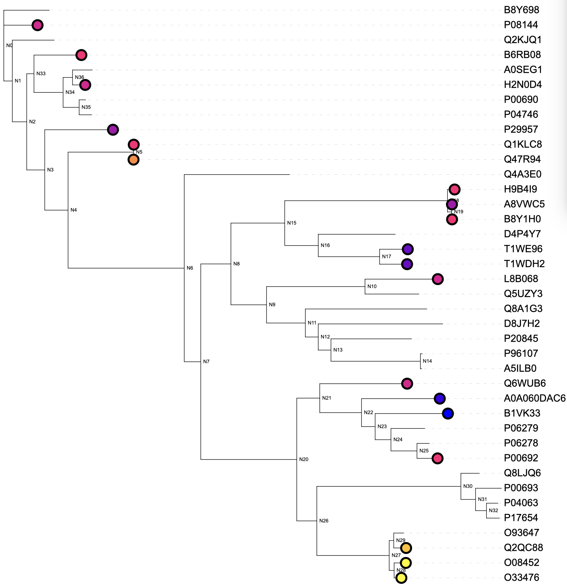
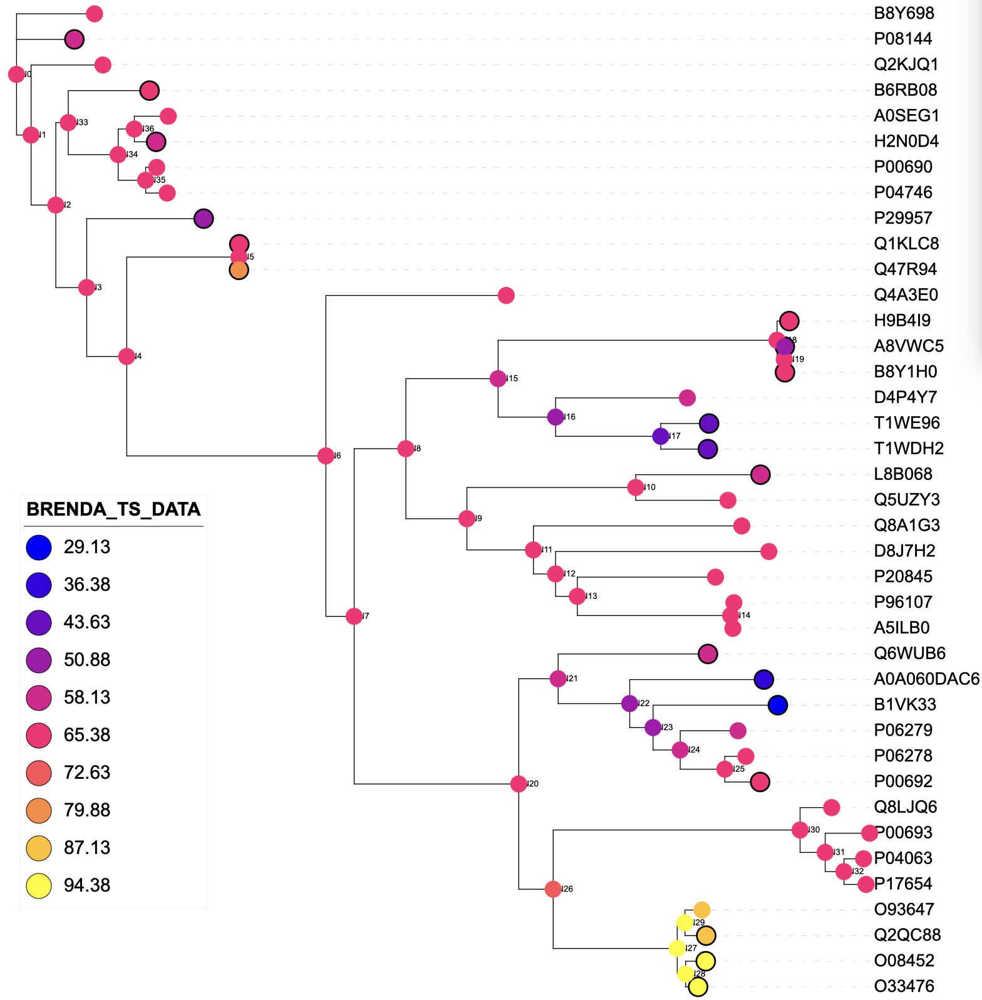

# ANNOTate Ancestral Reconstruction (AnnotAceR)

AnnotAceR is a tool to annotate ancestors and extant nodes in a phylogenetic tree by 
reference to a subset of nodes with known properties. These properties are reprsented by either 
discrete or continuous variables. In the latter case, it also uses latent discrete variables 
to mix (Gaussian) distributions of the observable continuous variable. The use of latent variables 
is optional for discrete observables.
AnnotAceR forms part of the GRASP-suite (Foley et al., 2022).

### Using AnnotAceR

`Usage: asr.AnnotAceR`

    [-nwk <tree-file> -in {<label>{:<parser>}@}<input-file> -out <output-file>]
    
    {-model <uniform(default)>}
    
    {-gamma <gamma-value(default 1.0)>}
    
    {-params <JSON-file>}
    
    {-latent <#states>}
    
    {-internal}
    
    {-learn}
    
    {-tied}
    
    {-seed <seed>}
    
    {-joint (default) | -marg {<branchpoint-id>}}
    
    {-format <TSV(default), TREE, STDOUT, ITOL>}
    
    {-help|-h}
    
    {-verbose|-v}

    where
    tree-file is a phylogenetic tree on Newick format
    input-file is a table with sequence or ancestor names in the first column, and corresponding values
    (empty or None or null implies not assigned) on TSV format
    label flags that a header is used in the input-file and identifies the column with values to be modelled;
    if no label is given, headers are assumed absent and values from the second column will be modelled
    parser identifies a parser to use on the column with values (e.g. BRENDA).
    output-file will contain:
    inferred branch point states on specified format (TSV by default, TREE is a labelled tree on Newick format, ITOL is a dataset to decorate trees in iTOL.embl.de), or
    gamma-value is parameter to the uniform model (n-state generalisation of Jukes-Cantor)
    JSON-file contains a JSON string specifying the distribution for latent nodes (if latent mode is used)
    latent indicates that the tree consists of latent values only (latent mode), with specified values as extensions to the leaves.
    #states is the number of latent states to learn (should not exceed 25, labelled A-Z).
    internal indicates that internal nodes are also extended with user-specified or learned distributions (default leaves-only).
    learn excludes inference and instead prompts EM learning of parameters, using input data as training data.
    tied implies that the variance learned is the same across the latent states (only applicable when EM-learning GDTs; default is off).
    help prints out commandline arguments (this screen).
    verbose completes the requested steps while printing out messages about the process.

### Notes:

Evolutionary models of substitution are currently limited to uniform, which is an adaptation of Jukes-Cantor for arbitrary number of states (gamma-value is used by this model).

If specified values are real, a conditional Gaussian mixture distribution conditioned on latent state is learned.

If specified values are discrete, a multinomial distribution conditioned on latent state is learned.

Inference is either joint (default) or marginal (marginal allows a branch-point to be nominated; if one is not given all uninstantiated nodes are inferred).

### Examples

#### Example 1

Here we use a tree `ancestors.nwk` with extant nodes labelled by their accession IDs and internal, ancestor nodes labelled 
as per GRASP (N0, N1, etc in a depth first manner). Then we have a tab-separated value file (TSV file) with annotations 
`annotations.txt` extracted from various sources; each column has a header (e.g. `SUPERKINGDOM`) that we reference below.

We infer the joint labeling (`-joint`) of external and internal (`-internal`) nodes most likely to explain the labels in the matching annotation file.

`AnnotAceR -nwk ancestors.nwk -in SUPERKINGDOM@annotations.txt -joint -internal -out tst_Taxonomic_lineage_SUPERKINGDOM.txt -format ITOL`

Here are 10 lines from `annotations.txt`:
```
Entry	PHYLUM	SUPERKINGDOM	BRENDA_TS_DATA
A5ILB0	Thermotogae	Bacteria	None
P08144	Arthropoda	Eukaryota	57.7_count=1
P29957	Proteobacteria	Bacteria	44.1_count=1
H2N0D4	Chordata	Eukaryota	55_count=1
T1WDH2	Ciliophora	Eukaryota	40_count=1;50_count=2
T1WE96	Ciliophora	Eukaryota	40_count=1;50_count=2
H9B4I9	Firmicutes	Bacteria	62.3_count=2
A0A060DAC6	None	None	34_count=1;55_count=3
Q47R94	Actinobacteria	Bacteria	74_count=1
```

The result is here saved as an iTOL dataset file (`-format ITOL`), which we drop in the iTOL webtool once the tree file has been uploaded.


#### Example 2

`asr.AnnotAceR -nwk kari_ancestors.nwk -in NADPH_kcat@experiments.txt -latent 3 -learn -internal -params params_NADPH_kcat.json -out trn_NADPH_kcat.txt -format ITOL -seed 1 -tied`

Experimental values are available for a group of ancestors in `experiments.txt` (TSV file; note that ancestor names are numbers as generated by GRASP, not including the 'N' prefix):
```
Ancestor	NADPH_kcat	NADH_kcat	NADPH_km	NADH_km	NADPH_kcat_km	NADH_kcat_km	NADPH_Vmax	NADH_Vmax	NADH_Tm
615	0.102	0.04	0.106	0.251	0.965	0.158	1.02E-04	3.95E-05	75.0
459	0.244	0.213	0.06	0.131	4.081	1.627	1.22E-04	1.06E-04
608	0.854	0.582	0.563	0.854	1.518	0.681	8.54E-04	5.82E-04	100.0
95	0.474	0.456	0.177	0.217	2.686	2.119	4.74E-04	4.56E-04	90.0
29	0.028	0.04	0.112	0.074	0.245	0.538	2.75E-04	3.99E-05
227	0.138	0.083	0.2277	0.1702	0.607	0.546	1.38E-04	9.29E-05	95.0
79									85.0%
```

```agsl
{"Condition":[["NADPH_kcat_1"],["NADPH_kcat_2"],["NADPH_kcat_3"]],
"Pr":[[0.8539999487484222,0.007448424553531107],
[0.29523664088109924,0.007448424553531107],
[0.07218627893409603,0.007448424553531107]],
"Variable":{"Domain":{"Predef":"Real"},"Name":"0_Real"},"Nodetype":"GDT","TieVariance":2,"Index":[0,1,2]}
```


`asr.AnnotAceR -nwk kari_ancestors.nwk -in NADPH_kcat@experiments.txt -latent 3 -marg -internal -params params_NADPH_kcat.json -out tst_NADPH_kcat.txt -format ITOL -seed 1 -tied`

Sampling from Gaussian mixture at each uninstantiated node gives:


Change `-format TSV`.

```
Ancestor	NADPH_kcat
N0	0.754645807596001
N1	0.6482432683741166
N2	0.6378986978798374
N3	0.5932161625795987
N4	0.5734614385345007
N5	0.5261001211533353
tr|A0A0A7GET6|A0A0A7GET6_GEOAI	0.4469566331089113
N6	0.4536806953981594
N7	0.44623041036501315
```

#### Example 3

`asr.AnnotAceR -nwk 3_2_1_1_filt_ancestors.nwk -in BRENDA_TS_DATA:BRENDA@annotations.txt -learn -tied -latent 3 -internal -params params_BRENDA_TS_DATA.json -out tst_BRENDA_TS_DATA.txt -format ITOL -seed 2`

learns a single mixture of Gaussians for the continuous property values in the column `BRENDA_TS_DATA` extracted by the parser `BRENDA`. The mixture is saved in a file `params_BRENDA_TS_DATA.json`; 
the training data is re-saved for visualisation in iTOL as `tst_BRENDA_TS_DATA.txt`. Notice that the `-tied` variance option was used ensuring that the
variance for each component is the same value, pooled from all the data. This is recommended if the data is sparse.

The input tree file is on the Newick format with labelled extand and ancestor nodes (N0, ...), the other 
input file `annotations.txt` is a TAB-separated value file (TSV), which is partially shown in Example 1 above.

The Gaussian mixture file looks like this:
```
{"Condition":[["BRENDA_TS_DATA_1"],["BRENDA_TS_DATA_2"],["BRENDA_TS_DATA_3"]],
"Pr":[[89.33343935081669,51.919856563088985],
[60.4077134808605,51.919856563088985],
[35.758600529629916,51.919856563088985]],
"Variable":{"Domain":{"Predef":"Real"},"Name":"0_Real"},"Nodetype":"GDT","TieVariance":2,"Index":[0,1,2]}                    
```

The iTOL file follows the dataset format, so can be dropped into the iTOL webtool after the tree has been uploaded.



The inference for all other nodes can be done with the following command, making reference to the Gaussian mixture
generated above:

`asr.AnnotAceR -nwk 3_2_1_1_filt_ancestors.nwk -in BRENDA_TS_DATA:BRENDA@annotations.txt -marg -tied -latent 3 -internal -params params_BRENDA_TS_DATA.json -out trn_BRENDA_TS_DATA.txt -format ITOL -seed 2`

The inference generates another file, in this case again on the iTOL format, enabling it to be used as a second dataset
for visualisation. If you'd like it to be presented as a TSV file, use `-format TSV`.

This is the iTOL visual (added ontop of the previous with training data):


