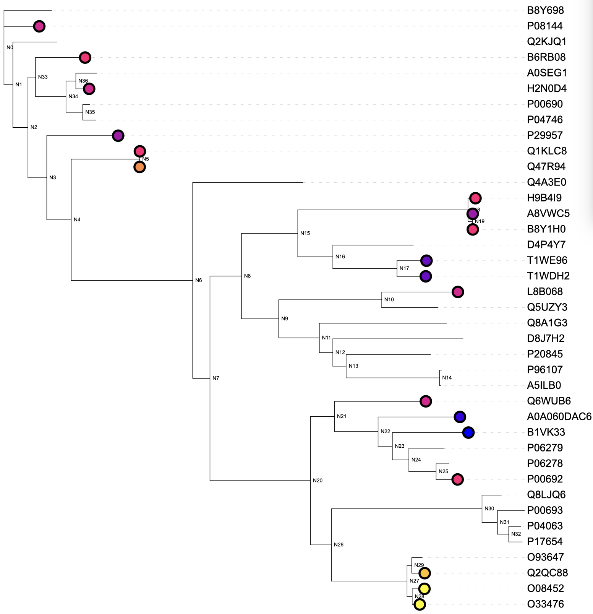
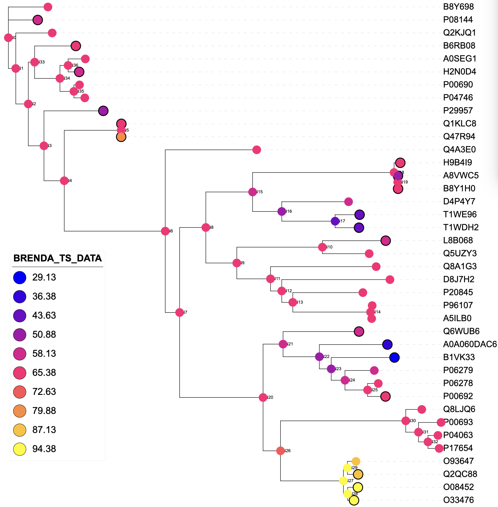

# TreeGazer


### Table of Contents

- [Using TreeGazer](#using-treegazer)
- [Notes](#example-1)

### Command line reference

`Usage: asr.TreeGazer`

     [-nwk <tree-file> -in {<label>@}<input-file> -out <output-file>]
        {-params <JSON-file>}
        {-latent <#states>}
        {-internal}
        {-learn}
        {-untied} 
        {-seed <seed>} 
        {-joint (default) | -marg {<branchpoint-id>} } 
        {-format <TSV(default), TREE, STDOUT, ITOL>}
        {-lambda <value (default 5.0)>}
        {-cmin <value (default: min of -in values)>}
        {-cmax <value (default max of -in values)>}
        {-help|-h}
        {-verbose|-v}

        where:
            tree-file is a phylogenetic tree on Newick format

            input-file is a TSV file with sequence or ancestor names in the first column, with corresponding values in the other columns (empty or None or null implies not assigned)
            
            label flags that a header is used in the input-file and identifies the column with values to be modelled; if no label is given, values from the second column will be modelled
            
            output-file is the prefix of the file, the type of file is changed by -format:
                - TSV by default containing both inferred and known nodes. 
                - TREE is a labelled tree on Newick format
                - ITOL is a dataset to decorate trees in iTOL.embl.de
            
            lambda is the multiplier for the upper confidence bound of predicted values (used only when latent mode with real values is applied)
        
            latent indicates the number of latent states to use.
              - The number of latent states to learn should not exceed 25 as latent states are labelled A-Z.
            
            internal indicates that internal nodes are also extended with user-specified or learned distributions (default leaves-only).

            learn excludes inference and instead prompts EM learning of parameters, using input data as training data.
            
            untied implies that the variance learned is NOT the same across the latent states (only applicable when EM-learning GDTs; default is tied variance).

            cmax and cmin specify the maximum and minimum values for the colour scale of iTOL output (only applicable when latent mode with real values is applied; default is to use the max and min of the input values).

            help prints out commandline arguments (this screen).

            verbose completes the requested steps while printing out messages about the process.

Evolutionary models of substitution are currently limited to uniform, which is an adaptation of Jukes-Cantor for arbitrary number of states.

If specified values are real, a conditional Gaussian mixture distribution conditioned on latent state is learned.

If specified values are discrete, a multinomial distribution conditioned on latent state is learned.

Inference is either joint (default) or marginal (marginal allows a branch-point to be nominated;
if one is not given all uninstantiated nodes are inferred)

### Model background

TreeGazer is a tool to annotate ancestors (internal) and extant (leaf) nodes in a phylogenetic tree by
reference to a subset of nodes with known properties. These properties are represented by either
discrete or continuous variables.

In the case of continuous variables, TreeGazer uses latent discrete variables
to mix Gaussian distributions of the observable continuous variables (Figure 1). The parameters for these
mixtures are learnt via expectation maximisation (EM) and are shared between all nodes in the tree; the 
states at the nodes are governed by an evolutionary model. The use of latent variables is optional
for discrete observables. TreeGazer can also perform direct inference whereby observed variables are mapped directly onto the
tree structure without any internal latent variables.

 Figure 1: A visualisation of the 
TreeGazer model structure when performing latent inference. Discrete latent nodes (circles) mimic the 
structure of the phylogenetic tree, while continuous, real nodes (squares) are fixed with known values 
for a given property (for example, a kinetic parameter). Users can specify any number of latent states,
with each latent state mapping to a Gaussian distribution for which parameters are learned from the data.

The table below summarises the main analyses TreeGazer can perform and the possible data types that can 
be used. the following sections will detail how to perform each type of analysis.  

| Mode        | Outcome                                           | Input Data Type   |
|-------------|---------------------------------------------------|-------------------|
| Direct      | Joint reconstruction                              | Discrete only     |
| Direct      | Marginal reconstruction                           | Discrete only     |
| Latent      | Learning                                          | Discrete and real |
| Latent      | Marginal reconstruction (learning required first) | Discrete and real |
| Latent      | Joint reconstruction (learning required first)    | Discrete and real |


### Examples

#### Latent mode - learning

Before performing any type of latent inference, the distribution shared by all nodes must be first be learnt. Below is
an example of how the input TSV file should be formatted. Extant nodes are labelled by their accession IDs and 
internal, ancestor nodes are labelled as per GRASP (N0, N1, etc in a depth first manner). The node names must 
be in the first column. Note also that when no value is available you just leave that cell blank or use a value 
like `null`, `None`:

```
Entry	mean_retained_activity	std_retained_activity	Isobutanol_%
A0A2M7A7S6	0.3990116080000001	0.19623674311255804	8
N1	0.17249387866666666	0.038831346745923825	8
N227	0.4221575046666666	0.001622404	8
N28	0.8627858626666667	0.031306071743960474	8
N29	0.5615638736666667	0.008130065	8
N459	0.39025134166666664	0.013820733111537073	8
N608	0.10784281966666666	0.005627829	8
N615	0.6278029940000001	0.025805765715013116	8
N78	12.469763536666667	1.1619048626436186	8
N79	2.6974158083333335	0.051390714599450736	8
N82	2.074187615	0.2004342392387551	8
N95	0.3724682653333333	0.022329334151059477	8
A0A0K9HJH1	0.5610371706666667	0.029527957919090055	8
D3PT81	0.319143403	0.043889298	8
A0A1V4QSD8	1.3732522796666666	0.039652550084277975	8
```

Below is an example command to perform learning: 

`java -jar treegazer.jar -nwk kari.nwk -params kari_demo.params -latent 3 
-in demo.tsv -seed 42 -internal -learn -verbose`

The model uses three latent states (`-latent 3`) for which it invents three discrete values:
`mean_retained_activity_1`, `mean_retained_activity_2` and `mean_retained_activity_3`. Here we use a tree `kari.nwk`
which should contain the same labels as the TSV file. Because we are interested in learning the shared 
distribution for both internal and external notes, we use the `-internal` flag. If `-internal`isn't specified
but there are internal node annotations in the TSV file, these will be ignored.

By default, TreeGazer will assume that the second column of the TSV input contains the values to learn. However, you
can specify a specific column using the column name before the input file like so: 

`java -jar treegazer.jar -nwk kari.nwk -params kari_demo.params -latent 3 
-in mean_retained_activity@demo.tsv -seed 42 -internal -learn -verbose`

If in `-verbose` mode, TreeGazer will also print the parameters of the evolutionary model that describe the latent
variables. "R" specifes the instantaneous rate matrix for the 3 state model and "F" specifies the stationary 
frequencies of each latent state. TreeGazer assumes a uniform model, where all latent states are equally likely and 
the probabilities of transitioning between these states are also equally likely. 
```
"R" : [-0.66,  0.33,  0.33]
      [ 0.33, -0.66,  0.33]
      [ 0.33,  0.33, -0.66]
          
"F" : [ 0.33,  0.33,  0.33]
```

After the EM algorithm converges the parameters are saved into the file indicated by `-params`. 
```
{"Condition":[["mean_retained_activity_1"],["mean_retained_activity_2"],["mean_retained_activity_3"]],
"Pr":[[12.469763536666667,0.11150665525484037],[2.049876146158595,0.11150665525484037],[0.4366513910438917,0.11150665525484037]],
"Variable":{"Domain":{"Predef":"Real"},"Name":"0_Real"},"Nodetype":"GDT","TieVariance":2,"Index":[0,1,2]}
```
The contents of "Pr" are the mean and variance respectively of each of the latent states. Note that the variance values 
are the same across all latent states, pooled from all the data. Tied variance used by default and is recommended in
most cases, especially if the data is sparse. This can be disabled by using the `-untied` flag. 

#### Latent mode - Marginal inference

Now that we have `kari_demo.params` we can perform actual inference. 

`java -jar treegazer.jar -out kari_demo -nwk kari.nwk -params kari_demo.params -latent 3 
-in demo.tsv -seed 42 -internal -learn -verbose`


Then we have a tab-separated value file (TSV file) with annotations 
`annotations.txt` extracted from various sources; each column has a header (e.g. `SUPERKINGDOM`) that we reference below.

We infer the joint labeling (`-joint`) of external and internal (`-internal`) nodes most likely to explain the labels in the matching annotation file.

`AnnotAceR -nwk ancestors.nwk -in SUPERKINGDOM@annotations.txt -joint -internal -out tst_Taxonomic_lineage_SUPERKINGDOM.txt -format ITOL`

Here are 10 lines from `annotations.txt`:
```
Entry	PHYLUM	SUPERKINGDOM	BRENDA_TS_DATA
A5ILB0	Thermotogae	Bacteria	None
P08144	Arthropoda	Eukaryota	57.7_count=1
P29957	Proteobacteria	Bacteria	44.1_count=1
H2N0D4	Chordata	Eukaryota	55_count=1
T1WDH2	Ciliophora	Eukaryota	40_count=1;50_count=2
T1WE96	Ciliophora	Eukaryota	40_count=1;50_count=2
H9B4I9	Firmicutes	Bacteria	62.3_count=2
A0A060DAC6	None	None	34_count=1;55_count=3
Q47R94	Actinobacteria	Bacteria	74_count=1
```

The result is here saved as an iTOL dataset file (`-format ITOL`), which we drop in the iTOL webtool once the tree file has been uploaded.


#### Example 2

This example learns distributions for continuous, experimental values, as observed for various ancestral 
reconstructions across a tree (yes, you can mix extants and ancestors). It then infers continuous values
for uninstantiated nodes in the tree, including other ancestors and all extants, conditioned on those 
that are known.

First, learning the distribution shared by all nodes (external and internal, as turned "on" by the option 
`-internal`). The model uses three latent states (`-latent 3`) for which it invents three discrete values: 
`NADPH_kcat_1`, `NADPH_kcat_2`, ... These are not shown by default in marginal inference, as the method 
instead opts to sample the continuous distribution many times to arrive at a mean value. 

`asr.TreeGazer -nwk kari_ancestors.nwk -in NADPH_kcat@experiments.txt -latent 3 -learn -internal -params params_NADPH_kcat.json -out trn_NADPH_kcat.txt -format ITOL -seed 1 -tied`

Experimental values are available for a group of ancestors in `experiments.txt` (TSV file; note that 
ancestor names are numbers as generated by GRASP, not including the 'N' prefix). Note also that when no 
value is available you just leave that cell blank or use a value like `null`, `None`:
```
Ancestor	NADPH_kcat	NADH_kcat	NADPH_km	NADH_km	NADPH_kcat_km	NADH_kcat_km	NADPH_Vmax	NADH_Vmax	NADH_Tm
615	0.102	0.04	0.106	0.251	0.965	0.158	1.02E-04	3.95E-05	75.0
459	0.244	0.213	0.06	0.131	4.081	1.627	1.22E-04	1.06E-04
608	0.854	0.582	0.563	0.854	1.518	0.681	8.54E-04	5.82E-04	100.0
95	0.474	0.456	0.177	0.217	2.686	2.119	4.74E-04	4.56E-04	90.0
29	0.028	0.04	0.112	0.074	0.245	0.538	2.75E-04	3.99E-05
227	0.138	0.083	0.2277	0.1702	0.607	0.546	1.38E-04	9.29E-05	95.0
79									85.0%
```

Training was done with tied variances as this dataset is extremely sparse (only five values known). 
The latent-to-continuous value distribution shared between nodes is saved after training as:
```
{"Condition":[["NADPH_kcat_1"],["NADPH_kcat_2"],["NADPH_kcat_3"]],
"Pr":[[0.8539999487484222,0.007448424553531107],
[0.29523664088109924,0.007448424553531107],
[0.07218627893409603,0.007448424553531107]],
"Variable":{"Domain":{"Predef":"Real"},"Name":"0_Real"},"Nodetype":"GDT","TieVariance":2,"Index":[0,1,2]}
```

The training data was saved as an iTOL dataset above and can be dropped into the iTOL webtool 
and shows up like this. 


Now, let's run the inference. 

`asr.TreeGazer -nwk kari_ancestors.nwk -in NADPH_kcat@experiments.txt -latent 3 -marg -internal -params params_NADPH_kcat.json -out tst_NADPH_kcat.txt -format ITOL -seed 1 -tied`

Sampling from Gaussian mixture at each uninstantiated node gives:


Change `-format TSV` gives a file with this "head".

```
Ancestor	NADPH_kcat
N0	0.754645807596001
N1	0.6482432683741166
N2	0.6378986978798374
N3	0.5932161625795987
N4	0.5734614385345007
N5	0.5261001211533353
tr|A0A0A7GET6|A0A0A7GET6_GEOAI	0.4469566331089113
N6	0.4536806953981594
N7	0.44623041036501315
```

#### Example 3

`asr.TreeGazer -nwk ancestors.nwk -in BRENDA_TS_DATA:BRENDA@annotations.txt -learn -tied -latent 3 -internal -params params_BRENDA_TS_DATA.json -out tst_BRENDA_TS_DATA.txt -format ITOL -seed 2`

learns a single mixture of Gaussians for the continuous property values in the column `BRENDA_TS_DATA` extracted by the parser `BRENDA`. The mixture is saved in a file `params_BRENDA_TS_DATA.json`; 
the training data is re-saved for visualisation in iTOL as `tst_BRENDA_TS_DATA.txt`. Notice that the `-tied` variance option was used ensuring that the
variance for each component is the same value, pooled from all the data. This is recommended if the data is sparse.

The input tree file is on the Newick format with labelled extand and ancestor nodes (N0, ...), the other 
input file `annotations.txt` is a TAB-separated value file (TSV), which is partially shown in Example 1 above.

The Gaussian mixture file looks like this:
```
{"Condition":[["BRENDA_TS_DATA_1"],["BRENDA_TS_DATA_2"],["BRENDA_TS_DATA_3"]],
"Pr":[[89.33343935081669,51.919856563088985],
[60.4077134808605,51.919856563088985],
[35.758600529629916,51.919856563088985]],
"Variable":{"Domain":{"Predef":"Real"},"Name":"0_Real"},"Nodetype":"GDT","TieVariance":2,"Index":[0,1,2]}                    
```

The iTOL file follows the dataset format, so can be dropped into the iTOL webtool after the tree has been uploaded.



The inference for all other nodes can be done with the following command, making reference to the Gaussian mixture
generated above:

`asr.TreeGazer -nwk ancestors.nwk -in BRENDA_TS_DATA:BRENDA@annotations.txt -marg -tied -latent 3 -internal -params params_BRENDA_TS_DATA.json -out trn_BRENDA_TS_DATA.txt -format ITOL -seed 2`

The inference generates another file, in this case again on the iTOL format, enabling it to be used as a second dataset
for visualisation. If you'd like it to be presented as a TSV file, use `-format TSV`.

This is the iTOL visual (added ontop of the previous with training data):




