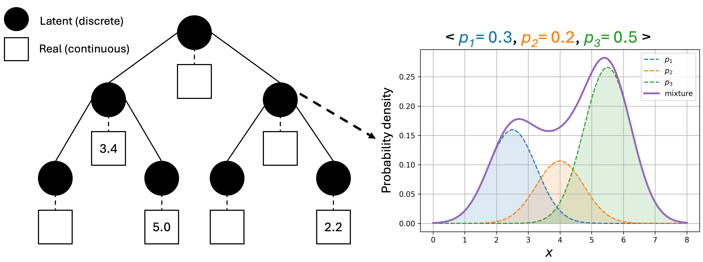
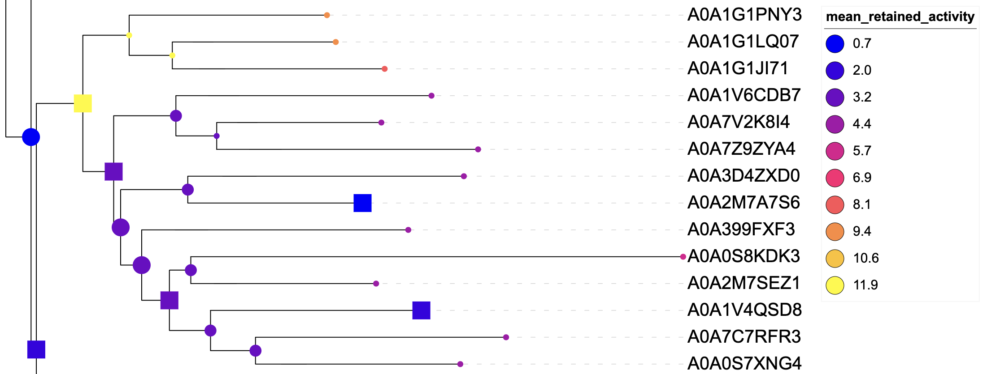
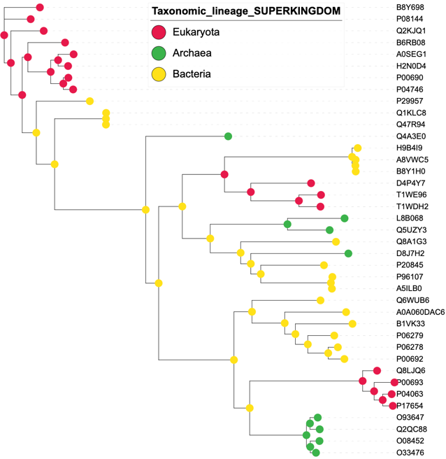

<div align="center">

# TreeGazer

**Annotate ancestor and extant nodes on a phylogenetic tree by learning from a subset of nodes with known properties.**

`version 1.0.0`

</div>

---

## Table of Contents

- [Quick Setup — Download & Run](#quick-setup--download--run)
- [Building from Source — Maven](#building-from-source--maven)
- [Model Background](#model-background)
- [Command-Line Reference](#command-line-reference)
- [Examples](#examples)
    - [Latent mode — learning](#latent-mode--learning)
    - [Latent mode — marginal inference](#latent-mode--marginal-inference)
    - [Latent mode — joint inference](#latent-mode--joint-inference)
    - [Direct mode — joint inference](#direct-mode--joint-inference)
    - [Direct mode — marginal inference](#direct-mode--marginal-inference)

---

## Quick Setup — Download & Run

1. **Install Java 11+.** Any OS works — macOS, Windows, Linux.
2. **Download the jar** from the [bnkit releases page](https://github.com/bodenlab/bnkit/releases).
3. **Sanity-check it:**

   ```console
   java -jar TreeGazer.jar -h
   ```

   You should see the full help text print to the console.

---

## Building from Source — Maven

1. Clone [bnkit](https://github.com/bodenlab/bnkit) in full. (JUnit 5 is only needed if you're a developer running the test suite.)
2. Confirm Maven is installed:

   ```console
   mvn -h
   ```

   If that fails, install it from [maven.apache.org](https://maven.apache.org/download.cgi), or via a package manager (`apt` on Ubuntu/Debian, `brew` on macOS).

3. From the repo root, build the jar:

   ```console
   mvn package -f poms/pomTreeGazer.xml -DskipTests
   ```

   `-DskipTests` skips the test suite — fine unless you're developing. The jar lands in `target/TreeGazer-<version>.jar`.

---

## Model Background

TreeGazer annotates ancestor (internal) and extant (leaf) nodes in a phylogenetic tree, using a subset of nodes whose properties are already known. Properties can be **discrete** or **continuous**.

| | |
|---|---|
| **Continuous variables** | Modelled with latent discrete variables that mix Gaussian distributions over the observable values. Mixture parameters are learned via expectation maximisation (EM) and shared across all nodes in the tree; node states are governed by an evolutionary model. |
| **Discrete variables** | Latent variables are optional — TreeGazer can map observed values directly onto the tree with **direct mode**, no internal latent states required. |


*Figure 1 — Discrete latent nodes (circles) mimic the phylogenetic tree's structure, while continuous, real nodes (squares) hold known values for a property (e.g. a kinetic parameter). Any number of latent states can be specified; each maps to a Gaussian distribution learned from the data.*

### Modes at a glance

| Mode | Outcome | Input data type |
|---|---|---|
| Direct | Joint reconstruction | Discrete only |
| Direct | Marginal reconstruction | Discrete only |
| Latent | Learning | Discrete and real |
| Latent | Marginal reconstruction *(learning required first)* | Discrete and real |
| Latent | Joint reconstruction *(learning required first)* | Discrete and real |

> **Evolutionary model:** Currently limited to a uniform model — an adaptation of Jukes-Cantor for an arbitrary number of states. Real-valued data is learned as a conditional Gaussian mixture; discrete data is learned as a conditional multinomial. Inference is joint by default, or marginal (optionally at a specific branch-point — otherwise all uninstantiated nodes are inferred).

---

## Command-Line Reference

### Required

| Flag | Description |
|---|---|
| `-nwk <tree-file>` | Phylogenetic tree, Newick format |
| `-in {<label>@}<input-file>` | TSV file: node/sequence names in column 1, values in other columns. Blank / `None` / `null` means "not assigned". Prefix with `<label>@` to pick which column to model — otherwise the second column is used |
| `-out <output-file>` | Prefix for the output file; extension/type set by `-format` |

### Optional flags

| Flag | Description |
|---|---|
| `-params <JSON-file>` | Path to save (learning) or load (inference) the learned model parameters |
| `-latent <#states>` | Number of latent states to use. Max 25 — states are labelled A–Z |
| `-internal` | Also model internal nodes (default is leaves-only) |
| `-learn` | Run EM learning instead of inference, using the input data as training data |
| `-untied` | Learn variance separately per latent state, rather than tied/shared (only for EM-learned GDTs; tied is default) |
| `-seed <seed>` | Random seed |
| `-joint` *(default)* / `-marg {<branchpoint-id>}` | Joint inference, or marginal (optionally at one branch-point) |
| `-format <TSV\|TREE\|STDOUT\|ITOL>` | Output format — `TSV` by default |
| `-lambda <value>` | Multiplier on the upper confidence bound of predicted values — latent + real-valued mode only. Default `5.0` |
| `-cmin <value>` / `-cmax <value>` | Min/max for the iTOL colour scale — latent + real-valued mode only. Defaults to the min/max of the input values |
| `-help` / `-h` | Print help |
| `-verbose` / `-v` | Print progress messages while running |

### Output formats

| Format | Contains |
|---|---|
| `TSV` *(default)* | Both inferred and known node values |
| `TREE` | Labelled tree, Newick format |
| `STDOUT` | Printed to console |
| `ITOL` | Dataset to decorate a tree at [iTOL.embl.de](https://itol.embl.de) |

### Full usage synopsis

```text
Usage: asr.TreeGazer 
        [-nwk <tree-file> -in {<label>@}<input-file> -out <output-file>]
        {-params <JSON-file>}
        {-latent <#states>}
        {-internal}
        {-learn}
        {-untied} 
        {-seed <seed>} 
        {-joint (default) | -marg {<branchpoint-id>} } 
        {-format <TSV(default), TREE, STDOUT, ITOL>}
        {-lambda <value (default 5.0)>}
        {-cmin <value (default: min of -in values)>}
        {-cmax <value (default max of -in values)>}
        {-help|-h}
        {-verbose|-v}
```

---

## Examples

### Latent mode — learning

Before running any latent inference, the shared distribution must be learned first.

**Input TSV** — extant nodes labelled by accession ID; internal/ancestor nodes labelled as in GRASP (`N0`, `N1`, … depth-first). Node names go in column 1. Leave a cell blank or use `null` / `None` where no value is available:

```
Entry	mean_retained_activity	std_retained_activity	Isobutanol_%
A0A2M7A7S6	0.3990116080000001	0.19623674311255804	8
N1	0.17249387866666666	0.038831346745923825	8
N227	0.4221575046666666	0.001622404	8
N28	0.8627858626666667	0.031306071743960474	8
N29	0.5615638736666667	0.008130065	8
N459	0.39025134166666664	0.013820733111537073	8
N608	0.10784281966666666	0.005627829	8
N615	0.6278029940000001	0.025805765715013116	8
N78	12.469763536666667	1.1619048626436186	8
N79	2.6974158083333335	0.051390714599450736	8
N82	2.074187615	0.2004342392387551	8
N95	0.3724682653333333	0.022329334151059477	8
A0A0K9HJH1	0.5610371706666667	0.029527957919090055	8
D3PT81	0.319143403	0.043889298	8
A0A1V4QSD8	1.3732522796666666	0.039652550084277975	8
```

**Run learning:**

```console
java -jar treegazer.jar -nwk kari.nwk -params kari_demo.params -latent 3 \
  -in demo.tsv -seed 42 -internal -learn -verbose
```

- `-latent 3` invents three discrete states: `mean_retained_activity_1`, `_2`, `_3`
- `kari.nwk` must use the same labels as the TSV
- `-internal` is required to learn from (and later annotate) internal nodes — without it, any internal-node annotations in the TSV are ignored

**Modelling a specific column:** by default the second TSV column is used; name a different one with `<column>@<file>`:

```console
java -jar treegazer.jar -nwk kari.nwk -params kari_demo.params -latent 3 \
  -in mean_retained_activity@demo.tsv -seed 42 -internal -learn -verbose
```

**Verbose output** prints the evolutionary model parameters for the latent variables: `R` is the instantaneous rate matrix for the 3-state model, `F` the stationary frequency of each latent state. TreeGazer assumes a uniform model — all latent states equally likely, all transitions between them equally likely:

```
"R" : [-0.66,  0.33,  0.33]
      [ 0.33, -0.66,  0.33]
      [ 0.33,  0.33, -0.66]
          
"F" : [ 0.33,  0.33,  0.33]
```

Once EM converges, parameters are written to the `-params` file:

```json
{"Condition":[["mean_retained_activity_1"],["mean_retained_activity_2"],["mean_retained_activity_3"]],
"Pr":[[12.469763536666667,0.11150665525484037],[2.049876146158595,0.11150665525484037],[0.4366513910438917,0.11150665525484037]],
"Variable":{"Domain":{"Predef":"Real"},"Name":"0_Real"},"Nodetype":"GDT","TieVariance":2,"Index":[0,1,2]}
```

`Pr` holds the mean and variance of each latent state. Variance is pooled and shared (**tied**) across states by default — recommended especially for sparse data — and can be disabled with `-untied`.

---

### Latent mode — marginal inference

With `kari_demo.params` learned, run inference:

```console
java -jar treegazer.jar -out kari_demo -nwk kari.nwk -params kari_demo.params -latent 3 \
  -in demo.tsv -seed 42 -internal -verbose -marg -out kari_demo_marg
```

Default output is a TSV with both known and inferred values:

```
Entry	mean_retained_activity (Mean)	mean_retained_activity (SD)	mean_retained_activity (UCB)
N0	0.4159883877711853	0.3399206669380877	2.1155917224616236
N1	0.17249387866666666		
N2	0.6965149831920605	1.6692858637489851	9.042944301936986
N3	1.252269881963146	2.83445639799529	15.424551871939595
N4	1.7435295250035734	3.579176033836374	19.639409694185446
N5	2.403442216905911	4.237785076700372	23.592367600407773
A0A0A7GET6	3.6236493368774387	4.9655733305662855	28.451515989708867
N6	3.605903787080107	4.956870443119277	28.39025600267649
N7	3.868271518731236	5.0899309538387705	29.31792628792509
```

- Nodes with a **known** value: mean/SD/UCB are left blank (not computed)
- Nodes **without** a known value: mean, SD, and UCB (upper confidence bound) are computed by sampling the Gaussian mixture at that node. UCB = mean + `lambda` × SD (default `lambda = 5.0`, override with `-lambda`)

**Visualising in iTOL:** add `-format ITOL` — squares represent training data, circles represent inferred values, and circle size reflects prediction confidence. The colour scale defaults to the min/max of the input data; override with `-cmin` / `-cmax` for comparability across datasets.



---

### Latent mode — joint inference

Infer the single joint labelling of latent states that best explains the data, using `-joint` instead of `-marg`:

```console
java -jar treegazer.jar -out kari_demo -nwk kari.nwk -params kari_demo.params -latent 3 \
  -in demo.tsv -seed 42 -internal -verbose -joint -out kari_demo_joint
```

`kari_demo_joint.tsv` contains the most likely latent state per node — equivalently, the most likely Gaussian distribution at that node:

```
Entry   mean_retained_activity
N0      mean_retained_activity_3
N2      mean_retained_activity_3
N3      mean_retained_activity_3
N4      mean_retained_activity_3
N5      mean_retained_activity_3
A0A0A7GET6      mean_retained_activity_3
N6      mean_retained_activity_3
N7      mean_retained_activity_3
A0A2A5QQ65      mean_retained_activity_3
```

---

### Direct mode — joint inference

Direct mode has no latent states, so observed values map straight onto the tree — a single inference step, no learning phase.

**Input TSV** — discrete annotations of taxonomic superkingdom for a subset of nodes:

```
Entry	PHYLUM	SUPERKINGDOM	
A5ILB0	Thermotogae	Bacteria	
P08144	Arthropoda	Eukaryota	
P29957	Proteobacteria	Bacteria
H2N0D4	Chordata	Eukaryota	
T1WDH2	Ciliophora	Eukaryota	
T1WE96	Ciliophora	Eukaryota	
H9B4I9	Firmicutes	Bacteria	
A0A060DAC6	None	None	
Q47R94	Actinobacteria	Bacteria
```

**Infer the joint labelling** of external and internal nodes that best explains the known labels:

```console
java -jar treegazer.jar -out kari_demo -nwk kari.nwk -in superkingdom@demo.tsv -seed 42 -internal -verbose -out kari_taxa_joint -joint
```

Saved as an iTOL dataset (`-format ITOL`) — drop it into iTOL once the tree file is uploaded.



---

### Direct mode — marginal inference

Also supported, but for **discrete data only** — use `-marg` instead of `-joint`:

```console
java -jar treegazer.jar -out kari_demo -nwk kari.nwk -in superkingdom@demo.tsv -seed 42 -internal -verbose -out kari_taxa_marg -marg
```

Output gives the probability of each node being in each state:

```
Entry	Eukaryota	Bacteria
N0	0.5	0.5
N2	0.9693484697521487	0.030651530247851267
N3	0.9180669129002216	0.0819330870997784
N4	0.8715425890702533	0.12845741092974677
N5	0.7956810969656312	0.20431890303436887
A0A0A7GET6	0.6574044328303008	0.3425955671696993
N6	0.6593567657556293	0.3406432342443707
N7	0.631639943967058	0.368360056032942
A0A2A5QQ65	0.5573169561287165	0.4426830438712836
```

> ⚠️ **No iTOL output for direct-mode marginal inference** — the result is a multinomial distribution over observed states, not a single value, so it can't be rendered as a tree visualisation.

---

